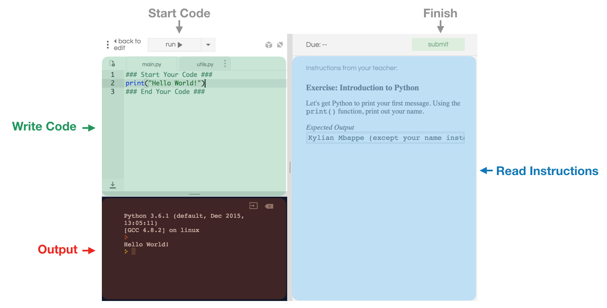

Hello! Welcome to the course notes for CS 106R. On this page, you'll find all of the material we'll cover in the class. We designed these course notes to be as lightweight as possible – that is, they will cover all the essentials but won't dive into material too deeply. Throughout you will find links to external resources we've found helpful in understanding concepts. 

[go to boolean](#anchor-boolean)


---
## What is Computer Science?
When you hear the words "computer science", what comes to mind? Do you think of computer programming – neon text on a black screen? Do you think of algorithms and equations scribbled on a whiteboard? Perhaps, when you hear "computer science", you think of computer and phone applications, websites and video games: WhatsApp, FIFA 18, PhotoShop. Maybe you think of computers that [drive](https://www.technologyreview.com/s/609450/autonomous-vehicles-are-you-ready-for-the-new-ride/), [beat us at board games](https://www.nytimes.com/2017/05/23/business/google-deepmind-alphago-go-champion-defeat.html) and [make sense of language](https://www.washingtonpost.com/business/economy/ais-ability-to-read-hailed-as-historical-milestone-but-computers-arent-quite-there/2018/01/16/04638f2e-faf6-11e7-a46b-a3614530bd87_story.html?noredirect=on&utm_term=.285b937ed479). Maybe you've seen the power of [molecular dynamics simulation](https://www.youtube.com/watch?v=5JcFgj2gHx8) and you think of biology or chemistry. Or when you hear computer science you think of art – personally, I often think of [this Pixar short](https://www.youtube.com/watch?v=lkQTe0Wdo2k) and marvel at the unbelieavable computer rendering of the ocean – or [music](https://vimeo.com/100624271) made by instruments that could only be forged with code. Maybe you think of [goal line technology](https://football-technology.fifa.com/en/standards/goal-line-technology/), applications that track your fitness, or [statistical models](https://projects.fivethirtyeight.com/2018-world-cup-predictions/) that predict the outcomes of football tournaments. Perhaps you're concerned about all the personal information that you hand over to Facebook and you think of the recent [Facebook-Cambridge Analytica fiasco](https://www.nytimes.com/2018/03/19/technology/facebook-cambridge-analytica-explained.html). When you hear computer science you might think of the [economic implications of automation](https://economics.stanford.edu/sites/default/files/april11.pdf) and its impact on inequality. Or maybe, when someone says computer science you don't really think of anything at all. The thing is, computer science is not one of these things more than any another – it is all of them and much more. 

Simply put, computer science is **the art of using computers to solve problems**. Computers can be used to solve a remarkably diverse set of problems, and that is why the visions of computer science listed above are so varied. The bottom line is: if we are getting a computer to solve a problem that it couldn't before, then we are practicing computer science – it doesn't matter what that problem is. So, as you begin this course, we'd recommend that you don't dwell too much on preconceived notions of what you think computer science is or isnt. Rather, come with an open mind and along the way consider: what problems would I like a computer to solve? 

## What is a Computer and what is Computer Programming?
Let's nail down exactly what we mean when we say "computer". In everyday speech, the word computer usually refers to laptops and desktops, like the one you're reading these notes on. However, in reality, a computer is a much more general concept and most computers hardly resemble laptops. The most powerful computers in the world, like [IBM's Summit supercomputer](https://techcrunch.com/2018/06/08/ibms-new-summit-supercomputer-for-the-doe-delivers-200-petaflops/), can take up a full-room's worth of space. Other computers are incredibly small and specialized, like the computer inside a [pacemaker](https://www.nhlbi.nih.gov/node/3465). Computers show up in places you might not expect them: microwave ovens, digital watches, traffic lights, microscopes, and MRI machines all have computers embedded inside them. If most computers lack screens or keyboards and don't resemble the computers to we're familiar with, what makes them computers? What ties all of these machines together?

A **computer** is a programmable, information-processing machine. It consists of a few physical components that allow it to perform four basic functions: 
1. _Input information_

   This is how the computer gets information from the world. We input information into our computers through our keyboard when we type. We're also inputting information into computers when we use a video camera or microphone. When we log onto a website, our computer receives input from an internet connection. Computers also receive input from permanent storage devices like hard drives. 
   
2. _Store information_

   A computer can hold information in temporary memory for later access. A computer's temporary memory is distinct from its permanent storage (i.e. hard drive, USB drive). When the computer is turned off, this memory dissapears, but it can be accessed much more rapidly than the information stored in a hard drive or USB drive. 
   
3. _Process information_ 
   
   A computer processes the information stored in memory. How it processes that information is dictated by a set of basic instructions provided by the user. The component of a computer responsible for processing information is called the central processing unit (CPU). The CPU reads the program, fetches information from memory, and processes that information as it was instructed to. What does this "processing" consist of? In general, the CPU is only capable of executing very simple operations: adding or subtracting numbers, copying or moving information, or evaluating numbers for equality. By linking these simple operations together, computer programmers can get the computer to perform challenging tasks.
   
4. _Output information_

   For a computer to be useful to us, it must output newly-processed information. A laptop computer outputs information through a computer screen or speakers. Computers also output information to other computers via the internet. 

Inside a computer there is typically at least one component for each of these four fundamental functions – input, output, store, and process. The four components are outlined in the figure below. The arrows indicate how information flows is passed through the computer.


More than anything else, what distinguishes computers from other machines is that they are **programmable**. That is, without changing a computer's physical design, we can get it to perform new tasks by following a new set of written instructions. That set of instructions is called a **computer program** and the act of writing the instructions is **computer programming**.

Computer programs are written in **programming languages**. A programming language is a precise language used to specify instructions to the computer.There are many, many programming languages – perhaps you've heard of a few like C++, Java or Python. Each consists of a set of rules and syntax that a programmer must follow in order to be understood by the computer.

## Introduction to Python 
In this course we'll be working with a programming lanugage called Python. We chose Python because it is powerful, fun to work with and extremely popular. That being said, this is an introductory course in Computer Science, not Python – the ideas and concepts we cover can be applied to programming in almost any language. 

### Coding with repl.it
We are going to use a website called [repl.it](repl.it) that allows us to code in Python online. All of our exercises and assignments will be on repl.it. Below we explain how to use repl.it to write Python code: 



1. **Read Instructions** – For each exercise in repl.it, we'll include instructions in the right panel (highlighted in blue above). The instructions will tell how to complete the exercise. 
2. **Write Code** – Once you've read the instructions, you'll want to start writing code. You will write your code in the top left (highlighted in green above). 
3. **Start Program** – After writing some code, you'll want to try running your program. To run the program click the `run` button above the coding area. 
4. **View Program** – The program will appear in the black area (highlighted in red above). 
5. **Finish** – When you've finished your program and its working as you'd like, you'll need to submit the exercise. To do so, click the submit button in the top right. Clicking submit 

### Python Files
Python programs are written in simple text files. These file names end with `.py`. Each line in the file is one instruction for the computer. When we run a Python program, the computer steps line by line through the file from the top to bottom reading one instruction at a time.

In the figure above, the panel highlighted in blue shows the python file that you are working on. 

### Running a Python Program 
To run a Python program on your computer, run the following command in your terminal, replacing `filename.py` with the path to your program file.
```Bash
python filename.py
``` 
In repl.it, you can run a Python file by simply clicking **Run**.  

### Our First Python Program 
Let's write our first Python program. Our program will  only do one thing: show a simple message `I am a Python program!`

To print text in Python, we can use the `print()` function. In the parantheses following `print`, we write the message we'd like to print. For example: `print("Hello!")`. Notice that the message itself needs be written within quotation marks.

Let's write a program to print the message from above: `I am a Python program`. 

_Python Code_
```python
print("I am a Python program!")
```
_Result_
```
> I am a Python program!
```

Let's try using `print()` in the following exercise: 
 
#### Exercise:  
<iframe frameborder="0" width="100%" height="600px" src="https://repl.it/student_embed/assignment/1211151/65629c184c91c55555e68086ece937d5"></iframe>

## Simple Functions
We used the `print()` function above to print our name. But, what is a function? 

> **Function** – Code that is grouped together and packaged under a name. So it can be called in one line.

 `function_name()`  

Python comes with  program can output text . 

Let's write our first program in Python. 


 ## PyBot 

### PyBot Functions 

`move()` Move PyBot one cell in the direction she is facing. 
Example: 

## Basic Types 
Learning Objectives
1. Show them the python interpreter
2. Get them comfortable with the interpreter
    a. Show them `control + C` and `control  + D`
3. Get them comfortable with floats, integers, booleans, and strings

### Variables

The fundamental building block of all programming languages is the *variable*. **A _variable_ is a word that stores a value.** Here are some examples of some variables and how they are used:

```python
x = 5
y = 4

z = x + y
```

Here, `x`, `y`, and `z` are all examples of variables.

### Types
There are four fundamental variable types in Python:

1. Integer
2. Float
3. String
4. Boolean

We will get into the definitions of these words below.

##### Integers

An _integer_ is a whole number...

```python
numPatients = 5
count = 0
```

##### Floats

A float a number that has decimal values...

They are initialized like integers, except with the addition of the decimal point and numbers that follow.

```python
volumeLevel = 0.93
totalScore = 100.0
```

##### Strings

Strings are _strings_ of characters of any kind. Look at the following examples:

```python
sentence1 = 'CS106R is awesome!'
emailDomain = '@gmail.com'
jerseyNumber = '9'
```

Here, `sentence1`, `emailDomain`, and `jerseyNumber` are all examples of Strings. Notice that a number can be a string.

##### [Boolean](#anchor-boolean)

Booleans are variables that represent True or False values.

_Why not use strings that say "True" or "False" instead?_

We use booleans because they take up less space in the computer. Instead of storing a string of characters, we can store a 0 for a False value, and a 1 for a True value.

```python
isGirl = True
isBoy = False
```

Now that we have gone through the different variables, let us talk about the operators...

### Operators

##### Arithmetic Operators

1. `**`
2. `*` or `/`
3. `+` or `-`

##### Boolean Operators

- `==`
- `!=`
- `>`
- `>=`
- `<`
- `<=`
