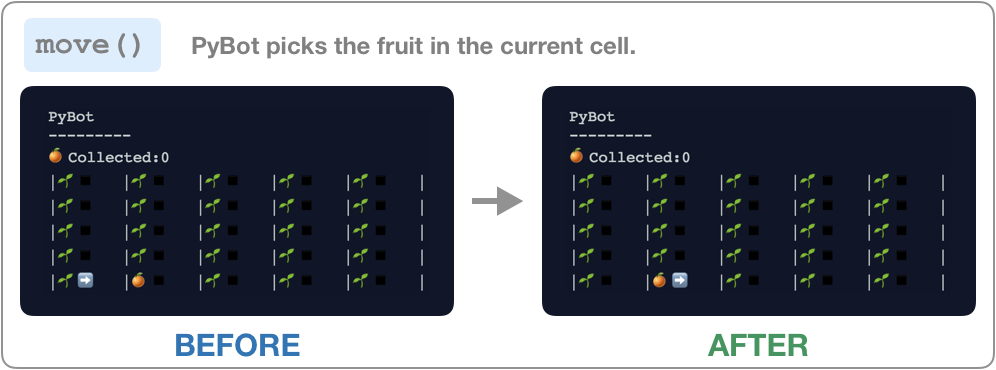
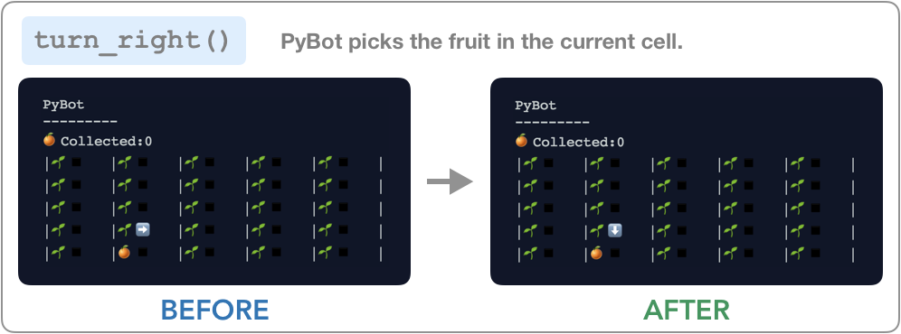
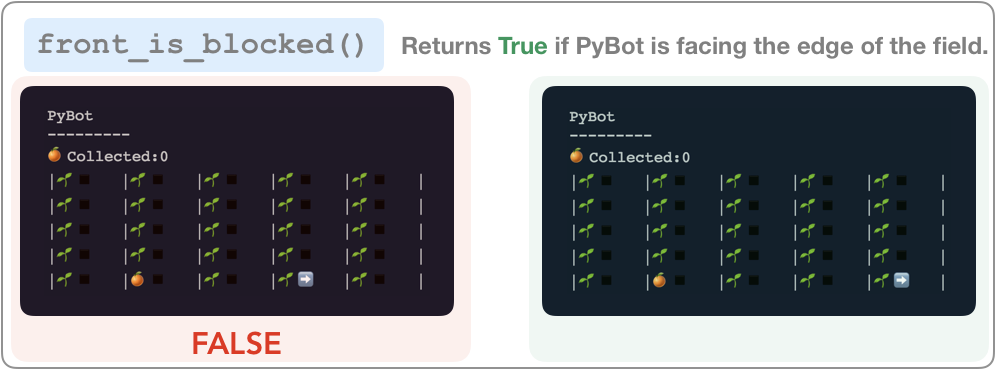

# Introducing PyBot and PyCountry
For the first week of the course, we're going to be working with a virtual robot name `PyBot`. We'll teach you some important Python concepts, and you will use those concepts to program PyBot. (PyBot is based very closely on Karel the Robot, a virtual robot that students work with in Stanford's introductory computer science course.)

This is PyBot: ➡️. She is a simple robot that lives in PyCountry, a land renown for its oranges (it said that an orange from PyCountry is easier to peel than any orange in the world). 

# PyCountry Fields 
The oranges in PyCountry grow in rectangular fields, like the ones shown below. 

TODO: Insert fields

Each field has 25 **cells** arranged in a 5x5 grid. In each cell there is:
1. An **orange plant**  where an orange can grow. If there is an orange hanging from the plant then you'll see an orange: 🍊. Otherwise, if there is no orange, you'll just see the seedling: 🌱
2. A **path** where PyBot can stand. Path's are just a black square: ◾️.

The four sides of a PyCountry field are labeled with the cardinal directions: _north, east, south_ and _west_. 


# PyBot

PyBot spends all of her time hanging out in PyCountry's orange fields. At all times:
1. PyBot is standing in one **cell** on the field
2. PyBot is facing the **direction** indicated by her arrow.

PyBot was built to perform only a small set of actions: she can move in the direction she is facing, turn herself 90 degrees to the right, and pick the orange in her cell if there is one. To get PyBot to do more complicated tasks, we'll need to program her in Python using PyBot functions. 

# PyBot Functions
## Commands
PyBot follows a few simple commands. We can program PyBot to perform a few simple actions by calling the following Python functions: `move()`, `turn_right()`, and `pick_fruit()`






## Conditions
PyBot is also able to answer a few yes or no questions about herself and the cell she is in. We can get the answer to those questions 





# Writing a PyBot Program
To program PyBot, we write a Python program that calls the functions above. We place these functions in the order we'd like in the `main()` function. 

> `main()` **Function** – The function that is executed at the beginning of a Python program. 

In the next section, you'll learn more about writing functions, including the `main()` function, so don't worry if this feels odd for now. The important thing to remember is: 
1. The `main()` function has a header `def main():`
2. Your program goes underneath the header indented one tab

This with make a lot more sense with a quick example. Let's write a simple PyBot program to pick up one orange. Notice how the three functions we want to call `move()`, `move()` and `pick_fruit()` are placed in the appropriate order beneath the header and are **indented in**. 

_Python Code_ 
```python
def main():
   move()
   move()
   pick_fruit()
```

_Result_


Now try it yourself in the exercise: 

<iframe frameborder="0" width="100%" height="600px" src="https://repl.it/student_embed/assignment/1310905/277b5035a363cda051dd6cbcec3666a8"></iframe>

**NOTE**: Although PyBot is simple, programming her is not. It can be very challenging, and don't be discouraged if your programs don't work at first. PyBot is almost identical to _Karel the Robot_ used in Stanford's Introductory CS course, and students often say it is the hardest part of the course. 
