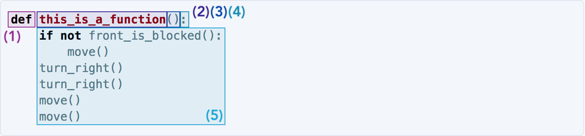

## Simple Functions
We used the `print()` function above to print our name. But, what is a function? 

> **Function** – Code that is grouped together and packaged under a name, so it can be called in one line.

Functions are the foundation of computer programming. Not only do they make it easier to read code, but they also allow us to write code that we can be reused over and over. Well-written functions are the mark of an engineer with good **style**\*.

> **Style** - The elegance of a body of code. A program with good style typically has descriptive names and short, readable functions. We will go more into this later.)

### Syntax Breakdown

In order to understand the way functions work, we are going to break them down to their simplest components. Let's use a PyBot function as an example:

```python
def this_is_a_function():
    """
    This is an example function for the class notes.
    """
    if not front_is_blocked():
        move()
    turn_right()
    turn_right()
    move()
    move()
```
Functions are capable of doing many things, but here we will focus on the essential features of a function. We are going to break it down by parts.



A function in Python is always started with the word `def` (1). Following the word `def` is the name of the function, in this case `this_is_a_function` (2), a set of parentheses (we will talk about these later) (3), and a colon (4). Following the _function header_ (what we call parts 1-4 all together), is the **body** of the function (5). The body of the function consists of a comment, and of course, the code itself. Notice that the body of the function is indented; this lets the Python interpreter know that the code underneath the function belongs to this specific function and not something else.

These components are present in _every single_ function, so if you understand this much, you are in pretty good shape!

### Calling Functions

In this section we will discuss how functions are used. The word we use when describing the act of using a function is **calling** a function.

> **Call** – To execute the code within a function. If one were to say "I called a function" it would mean that he/she used the function in a program to execute the code within.

Functions can call other functions. In fact, this is the way that most functions are used.

```python
def this_is_a_function():
    """
    This is an example function for the class notes.
    """
    if not front_is_blocked():
        move()
    turn_right()
    turn_right()
    move()
    move()

def main():
    this_is_a_function()

if __name__ == "__main__":
    main()
``` 

Here, we would say that the body of `main()` calls `this_is_a_function()`. We would also say that the body of `this_is_a_function()` calls the functions `move()`, `turn_right()`, and `front_is_blocked()`. We cannot currently see the bodies of these functions, but that is okay! More often than not, we use functions that are implemented by other people, in order to save us time and effort.

_But what is that funky statement calling main at the bottom?_

The statement below the `main()` function that calls `main()` is
just code that gets the program to run. Do not worry about it for now;
we will explain it later. For now, just know that that statement calls `main()`. In this class, it will always call `main()`, so you can think of `main()` as the starting point of all projects and exercises. 

Make sense? Let's go ahead and give it a try!

<iframe frameborder="0" width="100%" height="600px" src="https://repl.it/student_embed/assignment/1313668/30154e5dcb411e31a97bf6cf0ffca189"></iframe>

Well done! Now that you have an understanding of the concept of calling a function, let's move on to _writing_ some functions that we want to call.

### Function Implementation

In this section we are going to do a brief exercise in **implementing** functions.

> **Implementing** – ~Writing~ code! This is a technical word often used in computer science. We use this word because the word for a specific instance of written code is called an **implementation**. (There are many words like this that may require a bit of explanation. If you ever come across a word that is being used in a funny way, please do not hesitate to ask!)

Writing a function is not so difficult. For now, it is the simple act of coming up with a function name and writing the function body.

<iframe frameborder="0" width="100%" height="600px" src="https://repl.it/student_embed/assignment/1313845/bc277a9c04019488a587d930112ee0d4"></iframe>

Congratulations on writing your first set of functions! 


