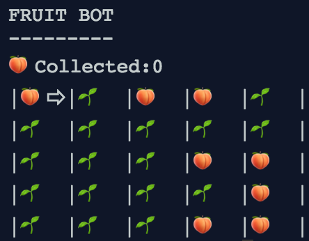

# Project 1 - PyBot

[Work on Project](https://geoffreyangus.github.io/CS106R/projects/project1)

**Due**: Week 2 in-class

**Topics**: Functions, Decomposition, Control Flow

**Description**: PyBot is a simple robot. She lives in the sparse planes PyCountry where peaches grow. In this project, we'll program PyBot to explore her world, harvest fruit and build cities.  (Based on CS106A's Karel the Robot)

---

# Project 2 - Calculator 

---

# Project 3 – Connect4

---

# Project 4 - TBA 

---

# Project 5 - Connect4, revisited 

---

# Project 6 - TBA

---

# Project 7 - TBA

